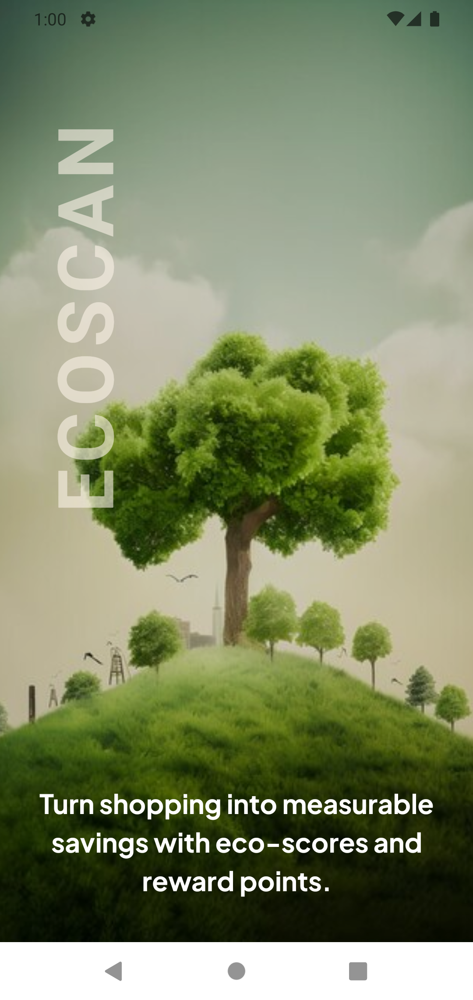
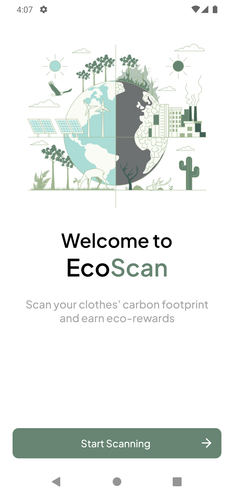
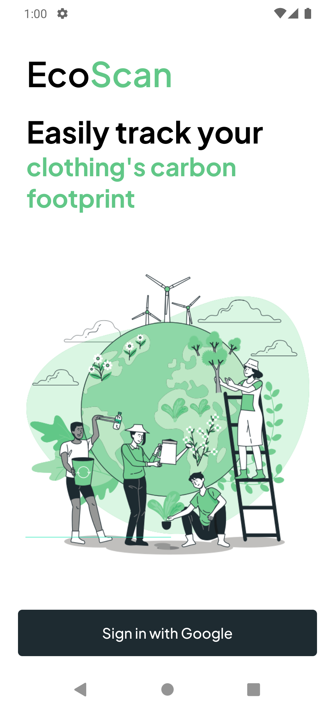
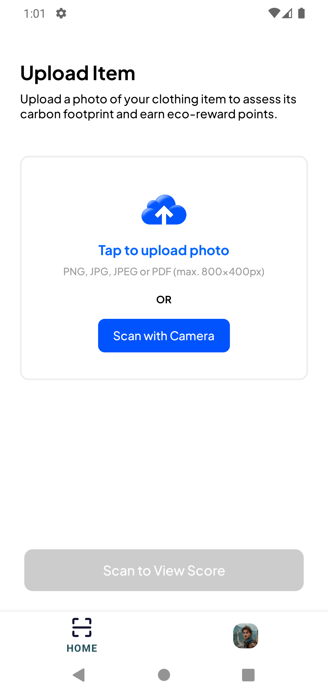
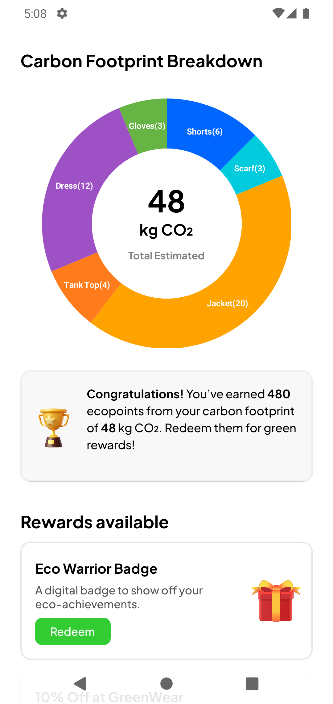
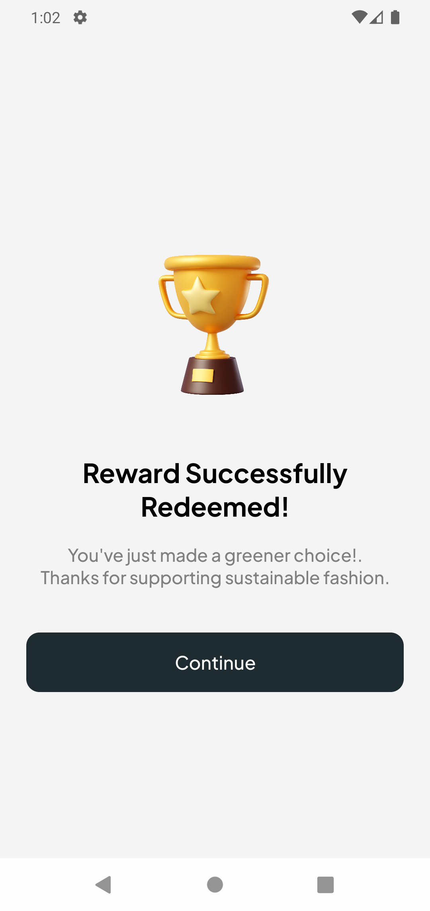

# 🌍 EcoScan — Clothing Carbon Footprint Scanner

EcoScan is a mobile application ddesigned to help users understand the environmental impact of their clothing. By uploading images of clothing items, users can see estimated carbon scores, earn eco-reward points, and redeem sustainability-focused offers. This project demonstrates a full-stack solution for a green initiative product.

## 🔧 Tech Stack

| Layer                 | Technology                                                         |
| --------------------- | ------------------------------------------------------------------ |
| **Frontend**          | React Native (with Expo)                                           |
| **Backend**           | Node.js with Express                                               |
| **Image Recognition** | OpenAI GPT-4o Vision API                                           |
| **Libraries**         | Axios, Lottie, Multer, FormData, React Native Pie Chart, Expo APIs |

---

## 🚀 Setup Instructions

### 1. **Clone the Repository**

First, clone the repository and navigate into the project directory:

```bash
git clone https://github.com/Md-Mursaleen/EcoScan-app.git
cd EcoScanApp
```

### 2. **Install Dependencies**

Run the following commands:

- **Backend**:
  ```bash
  cd EcoScanApp
  cd EcoScanApp-backend
  npm install
  ```
- **Frontend**:
  ```bash
  cd ..
  npm install
  ```

### 3. **Run the Application**

- **Backend**: Start the backend server:
  ```bash
  cd EcoScanApp-backend
  node app.js
  ```
- **Frontend**: Start the frontend application:
  ```bash
  npx expo start --dev-client  # here you first need to create an EAS build (custom dev client app)
  npx expo start               # if using Expo Go app
  ```

### 4. **Testing**

Run the tests to verify the setup:

```bash
# Frontend
npm test

# Backend (future enhancement)
jest or mocha
```

Create a `.env` file in the backend root directory:

```
OPENAI_API_KEY=your_openai_api_key
```

---

## Application Flow

1. Users upload or scan a clothing image.
2. The backend sends the image to OpenAI GPT-4o Vision API.
3. Clothing items are detected and classified.
4. Each item receives:
   - 🌍 Carbon Score (kg CO₂ emitted)
   - 🌱 Eco Points (as rewards)
5. The user can view:
   - Pie chart breakdown
   - Total carbon footprint
   - Total eco points
   - Redeemable eco-rewards

---

## 🌱 Carbon Score Assumptions

If the GPT-4o Vision API fails or is skipped, fallback logic assigns predefined scores:

| 👕 Clothing Item | 🌍 Carbon Score (kg CO₂) | 🌱 Eco Points |
| ---------------- | ------------------------ | ------------- |
| T-shirt          | 5                        | 50            |
| Jeans            | 10                       | 100           |
| Jacket           | 15                       | 200           |
| Shoes            | 8                        | 80            |

These values are stored in static JSON files under `data/` and applied via backend logic.

---

## Key Screens

### 🏠 Home Screen

- Upload or capture image
- Visual scan animation
- Progress indicator and file type icon
- Handles scanning and success states

### 📊 Details Screen

- Pie chart breakdown of carbon footprint
- Summary of total score and eco-points
- List of redeemable green rewards

---

## Enhancement Proposals

### 🔧 Technical Scaling

To transform EcoScan into a scalable, production-ready platform, here are proposed enhancements categorized by technical and product aspects:

---

### 1. ⚙️ Scaling the Backend for Larger User Loads

- **Move to a Microservices Architecture**: Break down monolithic logic (e.g., image analysis, scoring, rewards) into separate services to ensure independent scaling.
- **Asynchronous Processing**: Offload image classification and OpenAI Vision API calls to background workers using tools like **BullMQ** (Node.js), **Celery** (Python), or a job queue service.
- **Cloud Scalability**: Deploy backend to auto-scaling environments like **AWS Lambda**, **Google Cloud Run**, or **Azure App Service**.

---

### 2. 🌍 Improve the Carbon Scoring Model

- **Material-based Scoring**: Extend the model to differentiate between cotton, polyester, wool, etc., each with distinct CO₂ footprints.
- **Condition & Usage Factor**: Allow users to input whether the clothing is new, second-hand or upcycled to adjust scores accordingly.
- **Machine Learning Model**: In future iterations, train a custom model on labeled image datasets to predict material + item type more accurately than GPT-4 alone.

---

### 3. ✨ Enhance User Experience

- **Historical Impact Tracking**: Let users see their cumulative carbon savings over time.
- **Sustainability Comparisons**: Compare scanned items to eco-friendlier alternatives, giving users actionable swaps.
- **Gamification**: Add streaks, badges, and level-ups based on eco-points or reduced carbon impact.
- **Educational Nudges**: Use push notifications or modals to share facts about sustainable fashion.

---

### 4. 🔌 Integrate with External APIs

- **Real-time Product Data**: Integrate with clothing databases like **Good On You**, **Open Apparel Registry**, or **Sustainable Apparel Coalition**.
- **Geo-based Reward Integration**: Use Google Maps API to show nearby stores or platforms accepting eco-points or offering sustainable options.
- **Weather + Sustainability Tips**: Pull real-time weather data to suggest eco-friendly clothing choices.

---

These enhancements would not only scale the application for enterprise usage but also enrich its value as an educational and behavioral change tool in the fight against climate change.

---

## 🌐 Deployment

The frontend (mobile app) APK has been built and shared for review.  
**However, please note:** The backend is currently not deployed and frontend uses a local network (LAN) IP address for API calls (e.g., `http://192.168.x.x:8000`). As a result, the app's core features (e.g., image scanning, carbon scoring analysis) will not function unless the backend is also running locally on the same network.

### 🔧 To run the backend locally:

1. Navigate to the `/EcoScanApp-backend` folder.
2. Install dependencies:
   ```bash
   npm install
   ```
3. Start the server:
   ```bash
   node app.js
   ```
   This will run the server on `http://localhost:8000`.

> 🔁 For full functionality, replace the LAN IP in the frontend with your your machine LAN IP or use own deployed backend URL or use tools like [ngrok](https://ngrok.com/) for temporary tunneling during testing.

---

### 🚀 Future Deployment Recommendations

- **Frontend**: Use [Expo EAS](https://docs.expo.dev/eas/) to build to build production-ready APKs and submit the app to the Play Store or App Store.
- **Backend**: Use Render, Railway, or Heroku to host the Express server and expose `/analysis` and `/rewards` endpoints.

---

## 📁 Project Structure

```
EcoScanApp/
├── EcoScanApp-backend/
│   ├── routes/              # API endpoints
│   ├── utilis/              # GPT logic, scorers, reward logic
│   ├── data/                # Static fallback data (JSON)
│   └── app.js               # Main Express server
│
├── app/_layout.tsx          # React Native entry point
├── assets/                  # Images and animations
├── utilis/                  # UI utilities (e.g., scaling)
├── components/TabNavigator  # HomeScreen.tsx, DetailsScreen.tsx, ProfileScreen.tsx, RedeemScreen.tsx
├── components/Welcome       # WelcomeScreen.tsx
├── components/Auth          # LoginScreen.tsx
├── components/Splash          # SplashScreen.tsx
└── package.json             # Project config
```

---

## 📽️ Demo

A working demo of the application has been recorded and uploaded to Google Drive.

[Watch Demo on Google Drive](https://drive.google.com/file/d/1EHE6KVAO9PfDBVoNN7vtA_d9M01SwZeN/view?usp=drivesdk)

---

## 📬 Contact

Made with 💚 by **Md Mursaleen**

- 🔗 [LinkedIn](https://www.linkedin.com/in/md-mursaleen085/)
- 💻 [GitHub](https://github.com/Md-Mursaleen)
- 📧 [Email](mailto:mursaleenansari085@gmail.com)

---

## 💚 Thank You

> “What you wear shouldn't cost the Earth.”

Thank you for reviewing **EcoScan**. Let’s make sustainability accessible, actionable and stylish — one scan at a time.

## 📸 App Screenshots

### Splash Screen



### Welcome Screen



### Login Screen



### Home Screen



### Details Screen



### Redeem Screen


